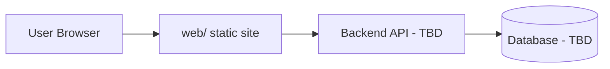

# Architecture

## Overview
High-level description of system components and how they interact.

## Components
- **web/** — static frontend (HTML/CSS/JS)
- **Backend** — TBD
- **Database** — TBD

## Deployment
TBD
